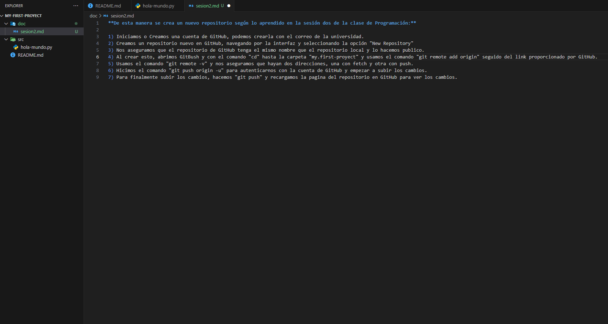

**De esta manera se crea un nuevo repositorio según lo aprendido en la sesión dos de la clase de Programación:**

1) Iniciamos o Creamos una cuenta de GitHub, podemos crearla con el correo de la universidad.
2) Creamos un repositorio nuevo en GitHub, navegando por la interfaz y seleccionando la opción "New Repository"
3) Nos aseguramos que el repositorio de GitHub tenga el mismo nombre que el repositorio local y lo hacemos publico.
4) Al crear esto, abrimos GitBush y con el comando "cd" hasta la carpeta "my.first-proyect" y usamos el comando "git remote add origin" seguido del link proporcionado por GitHub.
5) Usamos el comando "git remote -v" y nos aseguramos que hayan dos direcciones, una con fetch y otra con push.
6) Hicimos el comando "git push origin -u" para autenticarnos con la cuenta de GitHub y empezar a subir los cambios.
7) Para finalmente subir los cambios, hacemos "git push" y recargamos la pagina del repositorio en GitHub para ver los cambios.
